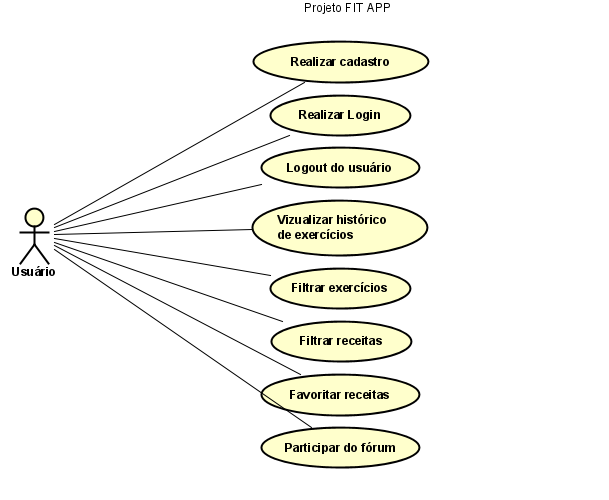

# Especificações do Projeto

Pré-requisitos: <a href="1-Documentação de Contexto.md"> Documentação de Contexto</a>

Definição do problema e ideia de solução a partir da perspectiva do usuário. É composta pela definição do  diagrama de personas, histórias de usuários, requisitos funcionais e não funcionais além das restrições do projeto.

Apresente uma visão geral do que será abordado nesta parte do documento, enumerando as técnicas e/ou ferramentas utilizadas para realizar a especificações do projeto

## Personas

> Persona 1

> Persona 2

## Histórias de Usuários

|EU, COMO...|            PERSONA	QUERO/PRECISO ... FUNCIONALIDADE                |	PARA ... MOTIVO/VALOR                                                               |
|----------|--------------------------------------------------------------------|-------------------------------------------------------------------------------------|
Pedro Silva| Desejo poder cadastrar e realizar login com uma conta              | Salvar minhas preferências no aplicativo                                            |
Pedro Silva| Desejo poder filtrar por exercícios da minha preferência           | Conseguir realizar os exercícios que eu quiser no dia                               |
Pedro Silva| Desejo obter informações sobre o mundo fitness dentro do aplicativo| Não perder meu tempo tendo que fazer pesquisas                                      |
Pedro Silva| Desejo poder filtrar as receitas pelo número de calorias           | Facilitar minha escolha da receita a ser preparada de acordo com minhas necessidades|
Ana Dias   | Desejo conseguir favoritar receitas                                | Não precisar pesquisar novamente o que eu irei preparar                             |
Ana Dias	 | Desejo poder discutir com outros usuários do aplicativo            | Trocar informações com pessoas com os mesmos objetivos que eu                       |
Ana Dias	 | Gostaria que a aplicação possuísse uma interface amigável          | Pois tenho um pouco de dificuldade em mexer em aplicativos                          |

## Requisitos

As tabelas que se seguem apresentam os requisitos funcionais e não funcionais que detalham o escopo do projeto.

### Requisitos Funcionais

|ID      | Descrição do Requisito  | Prioridade    |
|--------|-----------------------------------------|----|
|RF-001  | A aplicação deve permitir o cadastro, login e logout dos usuários | ALTA | 
|RF-002  | A aplicação deve permitir que o usuário veja o histórico de exercícios realizados   | MÉDIA |
|RF-003  | A aplicação deve permitir a filtragem de receitas baseada no número de calorias   | MÉDIA |
|RF-004  | A aplicação deve permitir que o usuário filtre pelos exercícios   | ALTA |
|RF-005  | A aplicação deve permitir que o usuário favorite as receitas   | MÉDIA |
|RF-006  | A aplicação deve oferecer um fórum de usuários onde os membros podem compartilhar experiências, dicas e suporte mútuo   | MÉDIA |
|RF-007  | O site deve oferecer informações relacionadas à atividades físicas e dietas, na tela principal, por meio de links externos  | MÉDIA |

### Requisitos não Funcionais

|ID     | Descrição do Requisito  |Prioridade |
|-------|-------------------------|----|
|RNF-001| A aplicação deve ser responsiva | MÉDIA | 
|RNF-002| A aplicação deve possuir uma interface amigável |  BAIXA | 

## Restrições

O projeto está restrito pelos itens apresentados na tabela a seguir.

|ID| Restrição|
|--|----------------|
|01| O projeto deverá ser entregue até o final do semestre|
|02| Não pode ser desenvolvido em um front server-based|
|03| Baixo orçamento|
|04| Poucos membros no time|

> **Links Úteis**:
> - [O que são Requisitos Funcionais e Requisitos Não Funcionais?](https://codificar.com.br/requisitos-funcionais-nao-funcionais/)
> - [O que são requisitos funcionais e requisitos não funcionais?](https://analisederequisitos.com.br/requisitos-funcionais-e-requisitos-nao-funcionais-o-que-sao/)

## Diagrama de Casos de Uso

> **Links Úteis**:
> - [Criando Casos de Uso](https://www.ibm.com/docs/pt-br/elm/6.0?topic=requirements-creating-use-cases)
> - [Como Criar Diagrama de Caso de Uso: Tutorial Passo a Passo](https://gitmind.com/pt/fazer-diagrama-de-caso-uso.html/)
> - [Lucidchart](https://www.lucidchart.com/)
> - [Astah](https://astah.net/)
> - [Diagrams](https://app.diagrams.net/)
