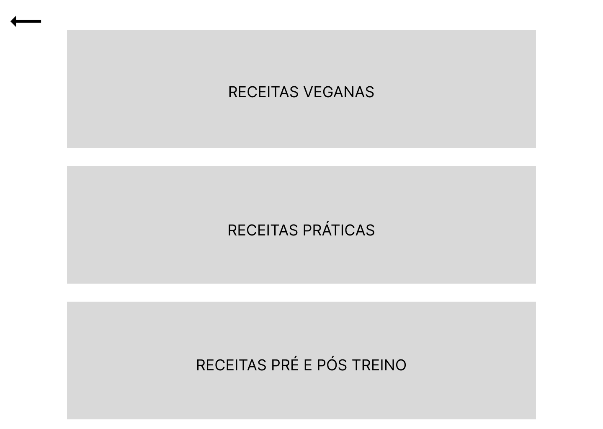

# Projeto de Interface

Pré-requisitos: <a href="2-Especificação do Projeto.md"> Documentação de Especificação</a>

Visão geral da interação do usuário pelas telas do sistema e protótipo interativo das telas com as funcionalidades que fazem parte do sistema (wireframes).

## Diagrama de Fluxo

Diagrama de Fluxo com funcionalidades e distintas telas.

## Wireframes

## Tela Inicial

## Tela Cadastro

## Tela Login

## Tela Principal

## Tela Receitas-Fit

## Tela Exercícios

## Tela Fórum-Clientes

Desenvolvidos com figma

#to-do referenciar projeto figma e subir-lo