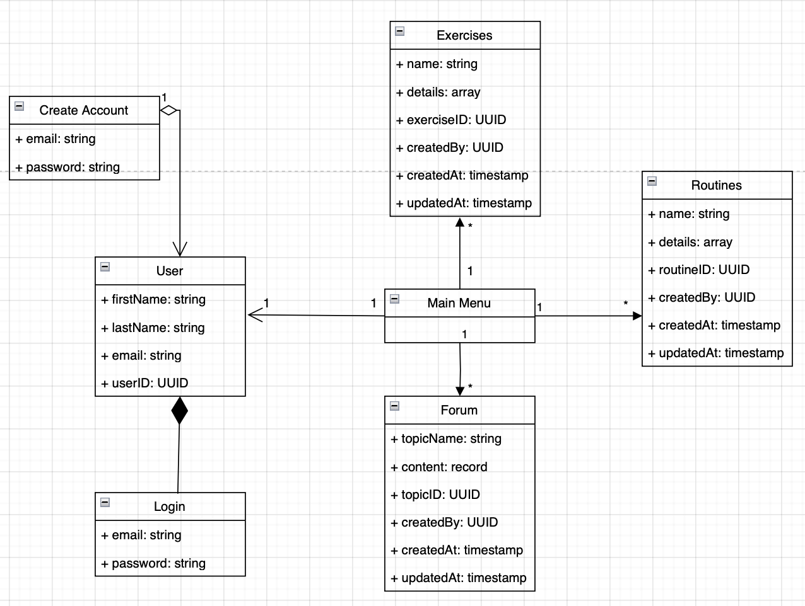
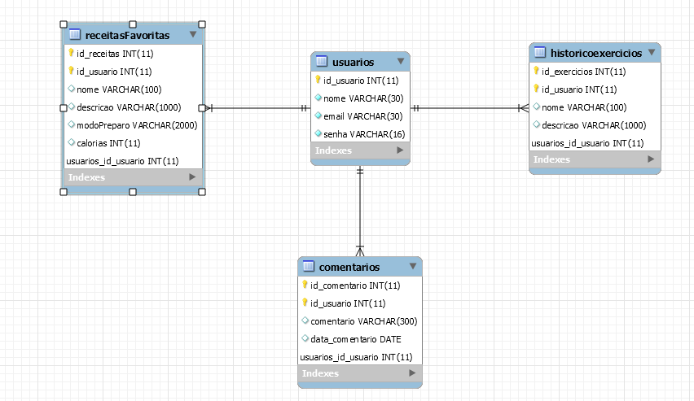

# Arquitetura da Solução

Pré-requisitos: <a href="3-Projeto de Interface.md"> Projeto de Interface</a>

Definição de como o software é estruturado em termos dos componentes que fazem parte da solução e do ambiente de hospedagem da aplicação.

## Diagrama de Classes

Diagrama de conceitual de classes do projeto.

## Modelo ER (Projeto Conceitual)

Diagrama de conceitual de entidades-relações do projeto.

## Projeto da Base de Dados

## Tecnologias Utilizadas

Se utilizará a suite da Google Cloud Platform (GCP) que oferece flexibilidade e simplicidade para a iteração web. Com firebase podemos ocupar as libs que já provem de manejo de sessão e credenciais para usuário, além de hosting flexível e serverless. Se requere levantar serviços para a iteração com o banco de dados relacional, e agregando métodos para gerar logs e poder realizar debug do aplicativo quando necessário.

## Hospedagem

O website será hospedado em Google Cloud Platform potenciado por Firebase para web e apis. Com backend em uma db cloud sql com psql (cloud sql).
