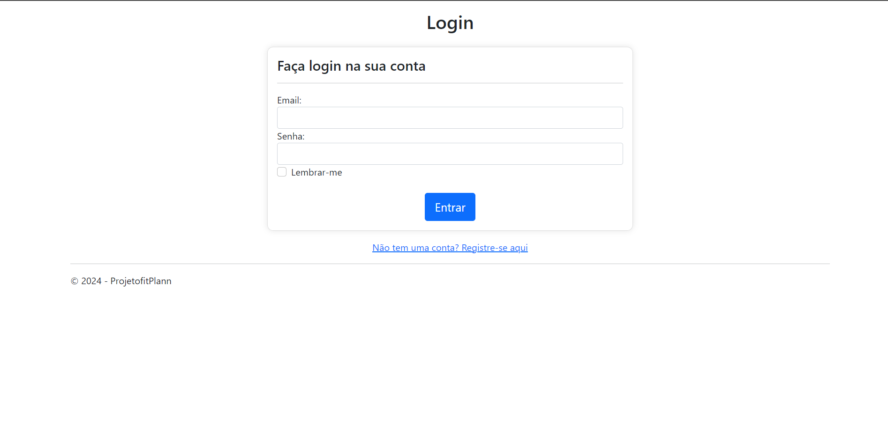
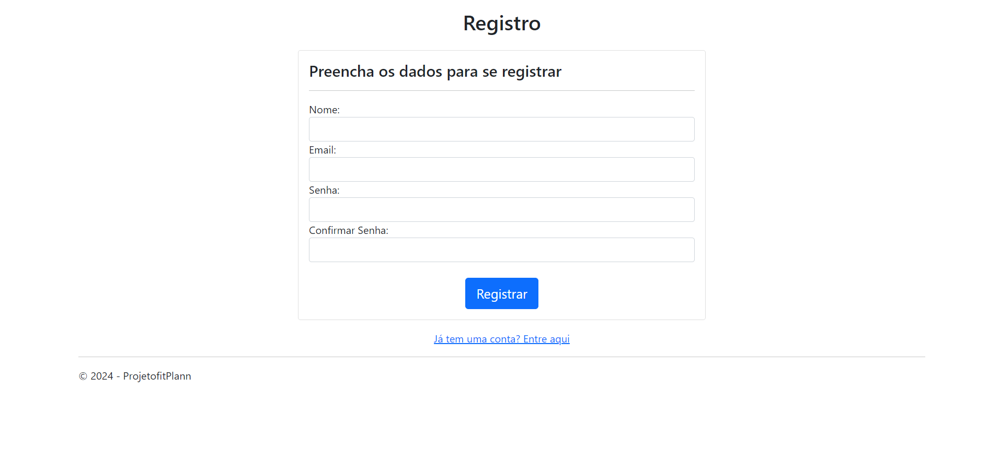
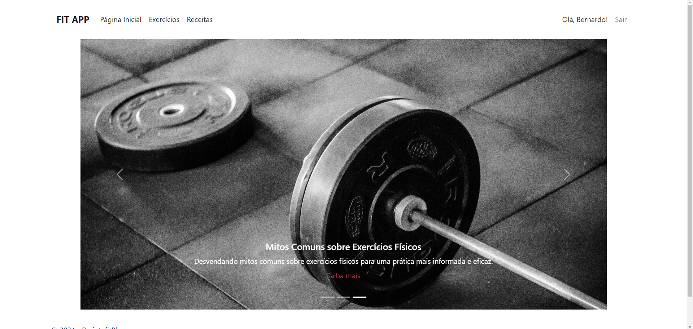
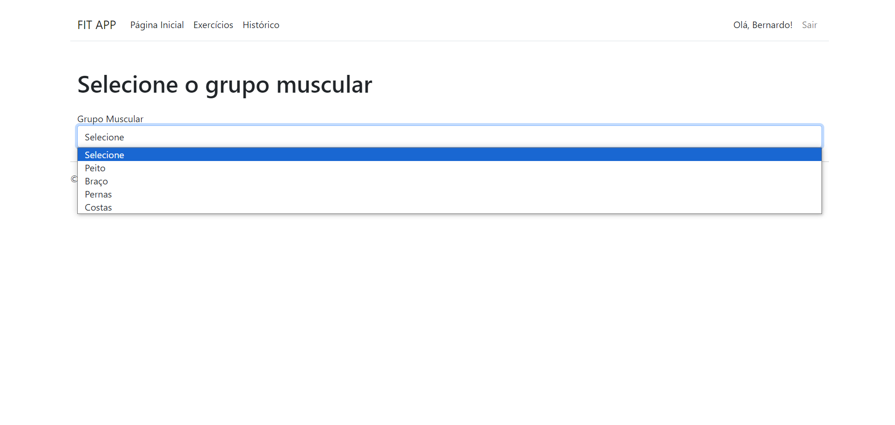
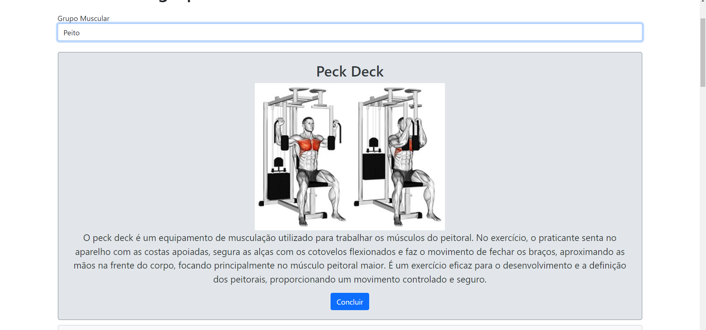
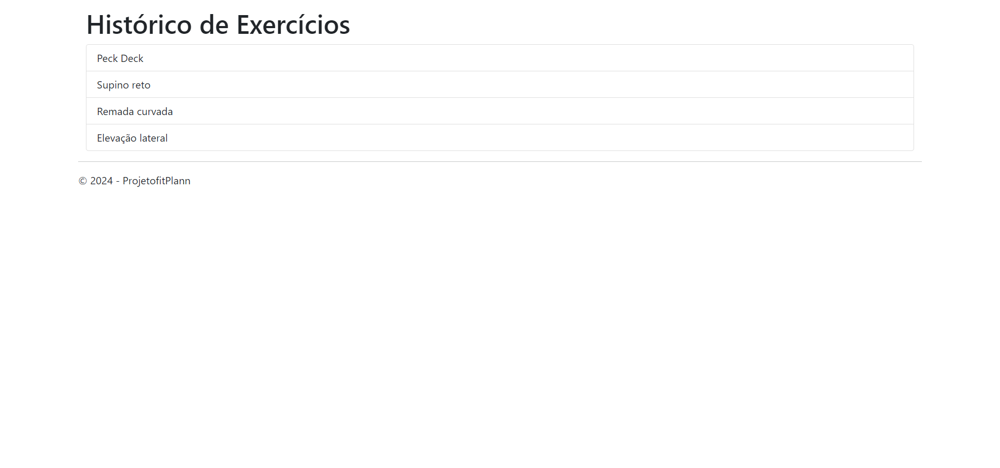
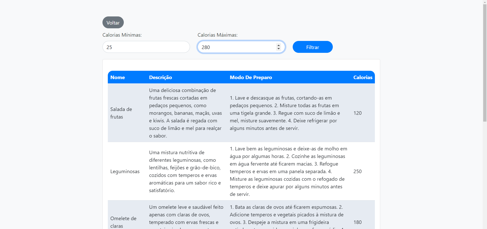

# Template Padrão da Aplicação

Pré-requisitos: <a href="2-Especificação do Projeto.md"> Especificação do Projeto</a>, <a href="3-Projeto de Interface.md"> Projeto de Interface</a>, <a href="4-Metodologia.md"> Metodologia</a>

Layout padrão da aplicação que será utilizado em todas as páginas com a definição de identidade visual, aspectos de responsividade e iconografia.

Tela de Login:

Tela de Cadastro:

Tela Principal:
Nessa tela estarão disponíveis os caminhos para a página de receitas, exercícios e a função de logout, além dos links exernos, ao clicar em "Saiba mais", nos carrosséis.

Tela de seleção dos exercícios:
Tela para a seleção de exercícios, basta clicar em selecionar. 

Tela dos exercícios:
Caso queira determinar que realizou um exercício, o usuário deve clicar em "Concluir", para que o exercício seja salvo na página de histórico.

Tela do histórico de exercícios:

Tela das receitas:

Tela para filtragem de receitas com base nas calorias

